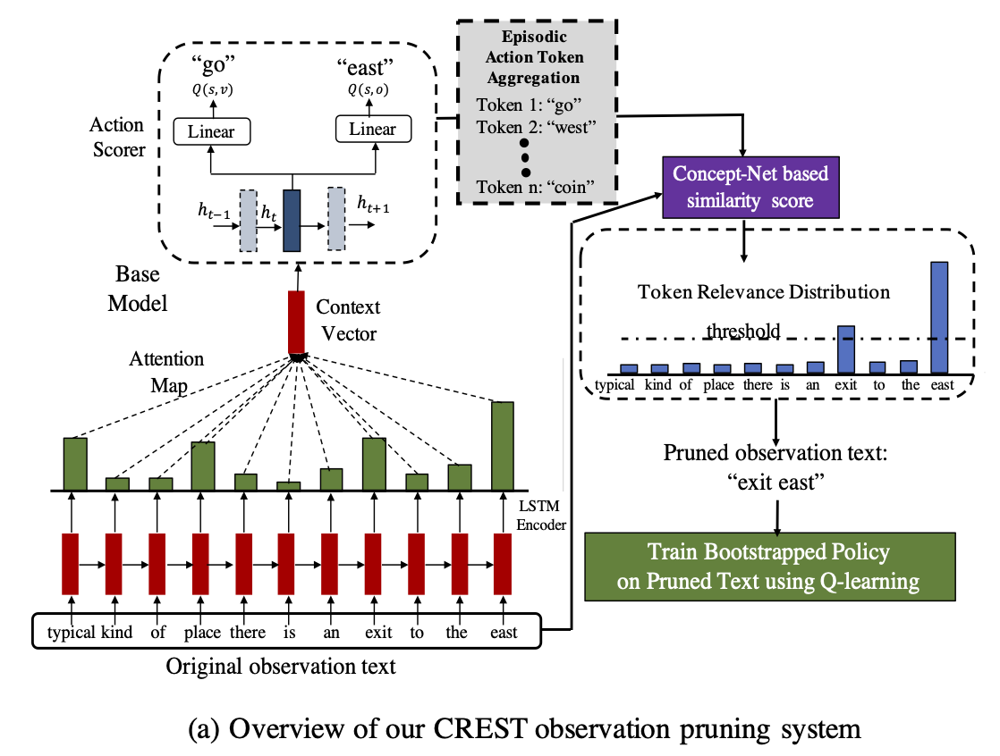
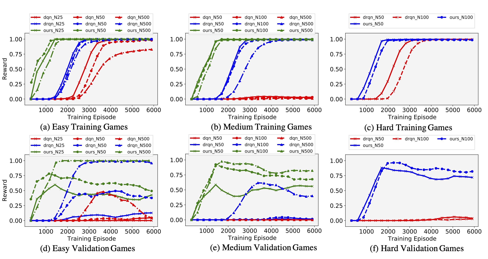
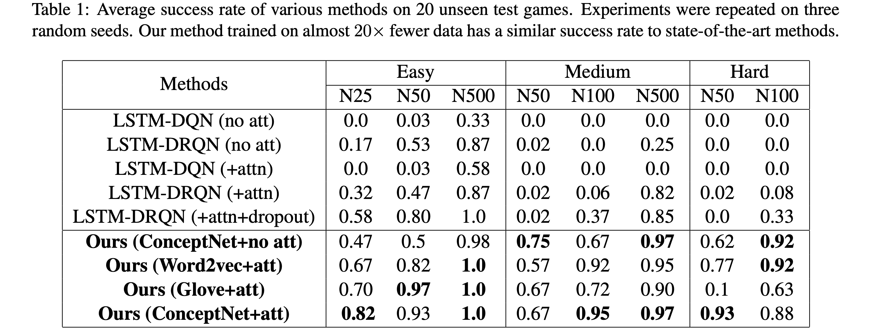
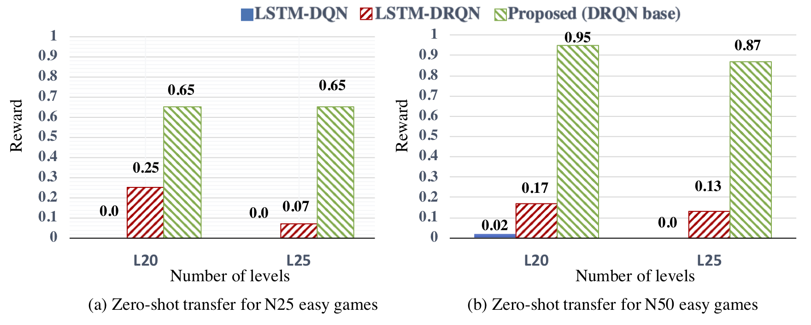

# CREST
Repository for EMNLP 2020 paper, [Bootstrapped Q-learning with Context Relevant Observation Pruning to Generalize in Text-based Games][crest_paper].

 ```
@inproceedings{chaudhury2020crest,
    title = "Bootstrapped Q-learning with Context Relevant Observation Pruning to Generalize in Text-based Games",
    author = "Chaudhury, Subhajit and Kimura, Daiki and Talamadupula, Kartik and Tatsubori, Michiaki and Munawar, Asim and Tachibana, Ryuki",
    booktitle = "Conference on Empirical Methods in Natural Language Processing (EMNLP)",
    year = "2020"
}
```

## Basic installation
Install editable version of this repository, as follows
```bash
git clone https://github.com/IBM/context-relevant-pruning-textrl
cd context-relevant-pruning-textrl
pip install -e .
```

## Dependencies installation
It is recommended to use a Anaconda + virtual environment. 
We assume CUDA10 (installed in `/usr/loca/cuda`) is installed.
### Install gym + pytorch
```bash
pip install gym
conda install pytorch torchvision cudatoolkit=10.0 -c pytorch
```
### Install textworld environment (either 1 or 2)
[TextWorld:Coin-collector][textworld_coin_branch]: Clone the `coin_collector` branch and `pip install -e .` inside the repository.<br /> 
For generating coin-collector games: `pip install -e ./crest/generator/gym_textworld` <br /> 

### Install other packages
```bash
pip install matplotlib tqdm opencv-python tensorboardX
pip install nltk spacy pygame bcolz
python -m spacy download en
python -c "import nltk; nltk.download('punkt')"
```
  
## How to generate games:
For coin collector games use the following script to generate games in 'gen_games' directory in the current location.
```
python -m crest.generator.gym_textworld.scripts.tw-make twcc_<type>_level<level>_gamesize<numgames>_step<step>_seed3_<mode>
- <type>     : can be `easy`, `medium` and `hard`
- <level>    : number of rooms to finish a quest
- <numgames> : number of games generated
- <step> : Maximum number of steps allowed in each episode of the game
- <mode> : Can be `train`, `validation` or `test` for different phases 
Eg: python -m crest.generator.gym_textworld.scripts.tw-make twcc_easy_level15_gamesize100_step50_seed3_train
```


## Bootstrapped Q-learning with Context Relevant Observation Pruning to Generalize in Text-based Games:
We present Context Relevant Episodic State Truncation(CREST) for noisy token removal in observation text that aids in improved generalization in RL policies. Our method first trains a base model using Q-learning, which typically overfits the training games. The base model’s episodic action distribution is used to perform observation masking to retain important tokens and remove noisy words from observation text. A second bootstrapped model is then retrained on the pruned observation text using Q-learning. 

<br /> 
*Overview of Context Relevant Episodic State Truncation (CREST) module using base model’s action similarity score to produce an attention masking the observation texts*

## Steps to train and test the base and proposed bootstrapped model
- Download the word embeddings (change the path of the embeddings in `textworld_compete/emnlp_github/crest/helper/bootstrap_utils.py`):<br /> 
**ConceptNet**: Download the embeddings following instructions at https://github.com/commonsense/conceptnet-numberbatch.<br /> 
**Glove**: Download `glove.6B.zip` from http://nlp.stanford.edu/data/wordvecs/glove.6B.zip.<br /> 

- Create the training, validation and held-out test games.
``` 
bash scripts/create_games.sh
 ```

- Create the directory for saving experiments, models and logs.
``` 
mkdir -p saved_models
mkdir -p experiments
mkdir -p ./data/teacher_data/
mkdir -p prune_logs/
mkdir -p score_logs/
```

- First step is to train the base model network using LSTM DRQN + attention:
The python script for training DRQN games for a single setting:
``` 
python -m crest.agents.lstm_drqn.train_single_generate_agent -c config -type easy -ng 25 -att -fr
``` 
To use single script for all games, use the following bash commands:
``` 
bash scripts/train_bootstrapped.sh base_drqn_easy
bash scripts/train_bootstrapped.sh base_drqn_medium
 ```

- The base model overfits on the training games, however the issued action commands by the base model on the training games can successfully solve them yielding correct observation text and action pair for each step. Therefore, by only retaining tokens in the observation text that are contextually similar to the base model’s action command on the train games, we can remove noise in the observation text. <br /> 

Next step is to obtain the overfitted actions (Episodic Action Token Aggregation) from the teacher model :
``` 
python -m crest.agents.lstm_drqn.prepare_gist -c config -type easy -ng 25 -th 0.5 -att
bash scripts/save_teacher_data.sh easy
bash scripts/save_teacher_data.sh medium
```

- Finally we train the CREST model on the pruned observation text. To train the easy and medium games on optimal threshold. (Bootstrapped model is enabled by `-student` and `-prune` option together)
```
python -m crest.agents.lstm_drqn.train_policy_qlearn -c config -type easy -ng 25 -att -student -fr -th 0.5 -prune
bash scripts/train_bootstrapped.sh bootstrap_easy
bash scripts/train_bootstrapped.sh bootstrap_medium
```

- Evaluate the trained models on held-out unseen test games and evaluate zero-shot transfer to unseen novel room configurations.
```
python -m crest.agents.lstm_drqn.evaluate_agents_att -c config -type easy -ng 25 -level 15 -att -m drqn
python -m crest.agents.lstm_drqn.evaluate_agents_att -c config -type easy -ng 25 -level 15 -att -th 0.5 -prune -student
bash scripts/evaluation_script.sh <type> <numgames>
bash scripts/evaluation_script_zero_shot.sh <type> <numgames>
```
The original and pruned observation texts are stored in `./prune_logs`. The evaluation results are stored in `./emnlp_logs`. 

## Results
- *Performance of models trained by various methods on training and validation games for coin-collector. On training games, our proposed CREST method converges nearly 10x faster that LSTM-DRQN and more than 20xfaster than LSTM-DQN. The performance of unseen validation games demonstrates the improved generalization of our method from 10−20xless training games.*


- *Evaluation of reward obtained by various methods on 20 unseen test games, depicting the average success rate for each method. The experiments were repeated on 3 random seeds and the mean value is reported here. Our method trained on almost 20x fewer data has a similar success rate to state-of-the-art methods.*


- *Zero-shot transfer to other configurations. We trained the RL policies for L15games and test the performance on L20 and L25games. CREST significantly outperforms the previous methods on such tasks.*



## Issue handling
Please raise issue if you find error in any part of the source code. The DRQN code is inspired from [LSTM-DRQN paper][drqn_paper] from [this][textworld_coin_branch] GitHub repository.


[pytorch_install]: https://pytorch.org/get-started/previous-versions/
[textworld_install]: https://github.com/Microsoft/TextWorld/
[conda_clone]: https://docs.conda.io/projects/conda/en/latest/user-guide/tasks/manage-environments.html#cloning-an-environment
[drqn_paper]: https://arxiv.org/pdf/1806.11525.pdf
[inform7_issue]: https://github.ibm.com/cognitive-robot-innovation-lab/textworld/issues/1
[crest_paper]: https://arxiv.org/abs/2009.11896
[textworld_coin_branch]: https://github.com/xingdi-eric-yuan/TextWorld-Coin-Collector